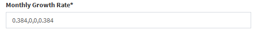

#### **Additional User Inputs Tab**

This tab contains a collection of input widgets for fine-tuning of model parameters to match user specifications.  Normally, these widgets are dynamically populated with default values based upon the species type selection. However, these values are flexible to user input for additional customization. Model results will update automatically every time a value is changed. This section will walk through the suite of background parameters and how they are incorporated into the bio-economic model.  

#### Farm Structure

While these two variables help define the production intensity, the physical lay-out of the farm is neither explicit nor considered by the model. Instead, the number of individuals to stock the farm with is determined through paired density values.

* Production Units- the number of grow out structures per hectare of farm. These structures include, but are not limited to: long lines, net pens, floating rafts, cages, and hanging lanterns.

* Stocking Density- the number of individuals per production unit. The density is set at this level to avoid confusion related to unit discrepancies between different grow out structures (i.e. kg/m for longlines but kg/m^3 for fish cages).

#### Biological Parameters

These variables are used to control the growth cycle as well as the amount of harvestable biomass. All rates take the form of a decimal between 0 and 1 (e.g. '0.05' = 5%) and the base unit for any "size" is kilograms. 

* Initial Stocking Size - the starting size for all individuals at the beginning of a harvest cycle

* Minimum Harvest Size- the threshold size for harvesting an individual. This size may be exceeded during a monthly timestep, but all surviving individuals will be harvested at their final size at the end of that month.

* Monthly Growth Rate - the amount of additional biomass an organism gains over a month in the form of a decimal relative to its mass at the beginning of the timestep. The growth rate (and all other model input rates) take the form of a decimal between 0 and 1 (e.g. '0.05' = 5%). The model allows for the input of multiple growth rates to simulate variation throughout the year. The series of rates must be separated by a comma and the total number inputted must be evenly divisible into 12 months. For example, if a user wanted to simulate growth that tapered to zero across a calendar year, they could input "0.3 , 0.2 , 0.1 , 0" (quotation marks added for clarity, see below for an example).

 

* Instantaneous Mortality Rate - the continuous rate at which individuals are naturally lost from the population. The model calculates the number of individuals who survive each month using the following formula:

  + survivors = individuals at stocking *x* *e*^((mortality rate *x* months since last stocking)^) 

#### Financial

The sole revenue generating process for the farm is assumed to be the wholesale of produced biomass.

* Discount Rate - the annual rate used in the financial analysis to decrease the magnitude of future costs and revenues relative to those closer to the present. The user is allowed to choose between a handful of common discount rates ranging from zero to ten percent (0 - 0.1).

#### Initial Investments

The start-up costs are binned into two categories: ones that are independent of farm size and those that scale with the number of units in production. The types of costs that fall into either category will vary by farm and business plan.

* Fixed Capital Costs - constant for all sizes of farm, may include expenses like permitting, purchasing a boat, and environmental assessments. 

* Size Variable Capital Costs - initial start-up costs that scale more directly with farm size.Examples are purchasing and deploying the materials that comprise the production units and other farm infrastructure, including lines, anchors, floats, etc.

#### Operational Costs

The cost of maintaining a farm in production once the initial investment is made. They are further subdivided based upon whether they scale with farm size and the frequency at which they are incurred. Once again, the classification of some costs may depend on user perspective and will vary from business plan to business plan. 

* Fixed Monthly Costs - paid out by the farmer every month regardless of the number of hectares under production. Administrative overhead and transit costs can be included here. 

* Size Variable Monthly Costs - directly variable with the farm size (hectares) and may include labor and the cost of feed for fed aquaculture 

* Additional Fixed Annual Costs - less frequent costs that are debited once each year. Examples include maintenance and insurance. In the model, these costs are incurred simultaneously during the final month of the year. 

#### Miscellaneous Costs

These costs are triggered when certain activities take place on the farm, namely stocking and harvesting the farm. They are assumed to vary with farm size linearly and are input on a per-hectare level. 

* Cost of seed and restocking - the cost of purchasing/acquiring seed or juveniles to stock the farm and the labor required to do so. The farmer pays these costs once at the beginning of the simulation and then every re-stocking of the farm thereafter. 

* Harvesting Cost - the cost of the labor and materials needed to harvest the farm's biomass once individuals have crossed the minimum harvest size threshold. Also includes any necessary post-harvest processing and packaging. Paid out at the end of every harvest cycle. 
