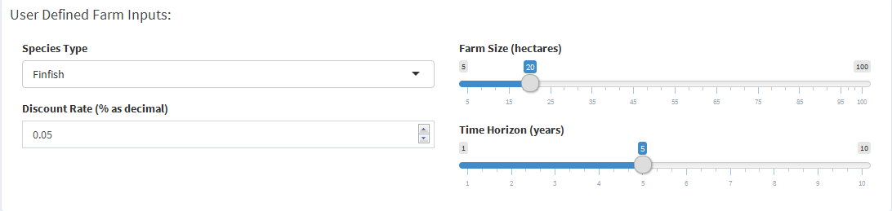

#### **Introduction**

This dashboard app was built to help visualize the magnitude and timeliness of expected cash flows associated with starting an aquaculture farm. Its interactive design gives users the flexibility to configure the model to fit their specifications. SFG's goal is to provide a base platform that can be extended in support of sustainable aquaculture initiatives around the world. We hope to improve the marine planning process by arming stakeholders with clear relevant information relevant to their specific circumstances and help foster a more cohesive coastal economy. 

This user reference guide will walk through the structure of the app, the underlying bio-economic model, and provide further detail on model inputs.   

#### Core Inputs

On the "Model & Outputs" tab, the user is first asked to define four key model parameters:

* the type of species to model
* the farm size in hectares
* an annual discount rate  to apply during the financial forecasting
* the time duration of the simulation in years

 

Specific holotypes were chosen to serve as the model organism for each species type. They were *Rachycentron canadum* (cobia), *Mytilus edulis* (blue mussel), and *Saccharina latissima* (sugar kelp) for 'finfish', 'shellfish', and 'seaweed' respectively. While the model's default specifications were selected with these species in mind, users can revise internal model parameters on the "Additional User Inputs" tab to match their species of interest. The size of the farm is used to scale the productive biomass as well as the variable initial capital and operational costs. The discount rate (and all other model input rates) take the form of a decimal between 0 and 1 (e.g. '0.05' = 5%).
