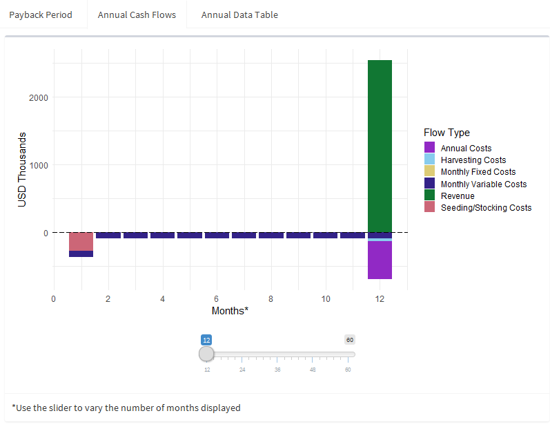

#### **Model & Outputs**

#### Bio-economic Model  

At the onset of the simulation, the number of individual organism on the farm is calculated by multiplying the number of hectares in production by the density of grow-out structures and the stocking density of the farmed organism. Grow-out structures such as longlines or net cages are referred to as "production units" in the user interface. This number is multiplied by the starting size of the organisms in kilograms (i.e. the mass of the fingerlings/seed/etc.) to calculate the initial productive biomass of the farm. Once stocked, the model iterates at a monthly time step.  

All organisms develop at a homogeneous rate, however, this growth can be set to be variable throughout the year. Please refer to the "Additional User Inputs Tab" section below for further information. An instantaneous mortality rate is applied to determine the number of surviving individuals after each timestep. At the end of the month, the new individual mass is checked against the minimum harvest size. If it is larger, the entirety of the farm's biomass is sold at once for a single wholesale price. The farm is then restocked and the next harvest cycle begins. Before the simulation begins, the number of harvest cycles that can be completed in full is calculated. This is done to avoid biasing the financial projections in a situation where a farm could incur the costs of restocking and operating without being able to realize that harvest during the specified time horizon.

The initial investment costs are calculated as a combination of fixed and size-variable costs. Fixed costs are assumed to be constant for all farm sizes and may include administrative and vehicle expenditures. Variable costs are scaled relative to the size of the farm and may include the materials needed for the production units , floats, anchors, and navigational aides. Operational costs are subdivided into fixed and variable monthly ones as well as annual costs that are incurred in the last month of every year. Finally, there are costs associated with harvesting and restocking the farm that are debited every time these activities occur. These expenses are input on a per-hectare basis to scale with the size of the farm. All costs taken from literature/case studies to act as default parameters have been scaled to 2018 USD to reflect [inflation](https://www.bls.gov/data/inflation_calculator.htm).

#### Output Visuals

On the "Model Outputs" tab, the user can find a collection of summary visuals and statistics categorizing the simulation results. On the top of the pane is a tabbed panel containing a pair of graphs and a data table. 

 

The first graph depicts the net present value (NPV) of the farm at an annual scale. The net present value is the cumulative profit garnered by farm operations with a user-specified discount rate applied. This allows for easy visual inspection of how certain parameters may affect the "break even time", that is the time where the net present value first surpasses zero and the farmer has recouped their initial investment expenses. The next plot shows the magnitude of costs and revenues on a monthly timestep with no discounting. This is intended to give a potential farmer an idea of what their cash flow might look like and allows for comparison to other relevant marine activities (e.g. fishing). A slider at the borrom of the plot allows for different windows of time to be examined (in annual increments of 12 months). Finally, a data table of annual aggregate farm statistics is provided for identification of numeric model outputs.

Alognside this set of plots is a series of boxes that relay key model statistics: the total initial investment, the mean annual profit, the break even time, and average annual productivity of the farm. The reported initial investment is the sum of the required fixed capital, the scaled per-hectare expenses, and the cost of initially stocking the farm (number of hectares x the restocking cost (per ha.)). Annual profit is reported as the mean difference between revenue and expenditures, with no discounting. If the farm is profitable at the end of the simulation, the first month is reported in which the net present value is positive. Else, the user is notified that the NPV < 0 at the time horizon. Finally, the mean total annual production is calculated for the duration of the simulation.
